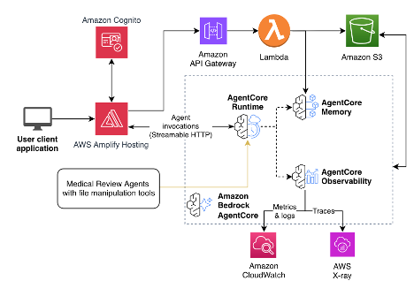

# Medical Content Review

Medical Content Review is an AI-powered multi-agent system for reviewing medical and pharmaceutical content for adherence issues. Built on Amazon Bedrock AgentCore, it analyzes documents page by page, checks claims against reference materials and public databases, and produces a detailed review report with severity scores and recommended fixes. This sample is built using the [Fullstack Solution Template for AgentCore](https://github.com/awslabs/fullstack-solution-template-for-agentcore).


**✨ Key features:**
- **Drag-and-drop upload**: Upload medical content PDFs and reference materials directly from the browser
- **Multi-agent review pipeline**: AI agents process PDFs, extract claims, and verify them against references
- **Reference verification**: Cross-check claims against PubMed, OpenFDA, ClinicalTrials.gov, and uploaded reference documents
- **Real-time results**: Split-pane UI shows review issues as they are found, with severity scoring
- **Detailed issue reports**: Each issue includes the quoted text, severity score, recommended fix, and source reference

## 🚀 Deployment

**Prerequisites**: [Node.js 20+](https://nodejs.org/), [AWS CLI](https://docs.aws.amazon.com/cli/latest/userguide/getting-started-install.html), [AWS CDK CLI](https://docs.aws.amazon.com/cdk/v2/guide/getting-started.html), [Python 3.10+](https://www.python.org/downloads/), [uv](https://docs.astral.sh/uv/), and [Docker](https://docs.docker.com/engine/install/). See the [deployment guide](docs/DEPLOYMENT.md) for details.

Deploying the Medical Content Review stack requires a few commands:

```bash
cd infra-cdk
cp .config_example.yaml config.yaml  # Create your config (edit as needed)
npm install
cdk bootstrap  # Once per account/region
npm run deploy
```

Available deploy commands (run from `infra-cdk/`):

```bash
npm run deploy            # Backend + frontend
npm run deploy:frontend   # Frontend only
cdk deploy                # Backend only
```

See the [deployment guide](docs/DEPLOYMENT.md) for detailed instructions.

## ▶️ Usage

1. Open the application URL (from CDK outputs)
2. Log in with Cognito credentials
3. Upload a medical content PDF (drag-and-drop or click to select)
4. Optionally upload reference materials
5. Click **Start AI Review** and watch as the agent:
   - Processes the PDF and splits content into batches
   - Extracts medical claims and statements
   - Verifies claims against reference materials and public databases
   - Generates a detailed review report with severity scores
6. Review detected issues in the results panel, download the report as JSON


## ℹ️ Architecture



The architecture uses Amazon Cognito in four places:
1. User-based login to the frontend web application
2. Token-based authentication for the frontend to access AgentCore Runtime
3. Token-based authentication for the agents in AgentCore Runtime to access AgentCore Gateway
4. Token-based authentication when making API requests to API Gateway

### Tech Stack

- **Frontend**: React with TypeScript, Vite, Tailwind CSS, and shadcn components
- **Agent**: Strands Agents SDK with BedrockModel
- **Authentication**: AWS Cognito User Pool with OAuth support
- **Infrastructure**: CDK deployment with Amplify Hosting for frontend and AgentCore backend


## 💻 Local Development

Local development requires a deployed stack because the agent depends on AWS services that cannot run locally:
- **AgentCore Memory** - stores conversation history
- **AgentCore Gateway** - provides tool access via MCP
- **SSM Parameters** - stores configuration (Gateway URL, client IDs)
- **Secrets Manager** - stores Gateway authentication credentials

You must first deploy the stack with `npm run deploy` (from `infra-cdk/`), then you can run the frontend and agent locally using Docker Compose while connecting to these deployed AWS resources:

```bash
export MEMORY_ID=your-memory-id
export STACK_NAME=your-stack-name
export AWS_DEFAULT_REGION=us-east-1

cd docker
docker compose up --build
```

See the [local development guide](docs/LOCAL_DEVELOPMENT.md) for detailed setup instructions.


## 📂 Project Structure

```
medical-content-review/
├── frontend/                 # React frontend application
│   ├── src/
│   │   ├── components/     # React components (shadcn/ui)
│   │   ├── hooks/          # Custom React hooks
│   │   ├── lib/            # Utility libraries
│   │   ├── services/       # API service layers (upload, feedback)
│   │   └── types/          # TypeScript type definitions
│   ├── public/             # Static assets and aws-exports.json
│   └── package.json
├── infra-cdk/               # CDK infrastructure code
│   ├── lib/                # CDK stack definitions
│   ├── bin/                # CDK app entry point
│   ├── lambdas/            # Lambda function code (feedback, upload)
│   ├── .config_example.yaml # Example deployment configuration
│   └── config.yaml         # Your deployment configuration (gitignored)
├── patterns/               # Agent pattern implementations
│   └── medical-content-review/ # Medical review agent
│       ├── medical_review_agent.py # Main agent with Gateway tools
│       ├── review_upload_hook.py   # S3 upload for real-time display
│       ├── system_prompt.txt       # Review workflow prompt
│       ├── tools/                  # PDF processor, claim extractor, etc.
│       ├── requirements.txt
│       └── Dockerfile
├── gateway/                # Gateway utilities and tools
│   └── tools/              # Gateway tool implementations
├── docker/                 # Local development Docker setup
│   └── docker-compose.yml
├── scripts/                # Deployment and test scripts
├── docs/                   # Documentation
└── README.md
```

## 🔒 Security

Note: this asset represents a proof-of-value for the services included and is not intended as a production-ready solution. You must determine how the AWS Shared Responsibility applies to your specific use case and implement the needed controls to achieve your desired security outcomes.

## 👤 Team

|   |  |  |
|---|---|---|
| [Nikita Kozodoi](https://www.linkedin.com/in/kozodoi/) | [Elizaveta Zinovyeva](https://www.linkedin.com/in/zinov-liza/) |  [Aiham Taleb](https://www.linkedin.com/in/aihamtaleb/) |
