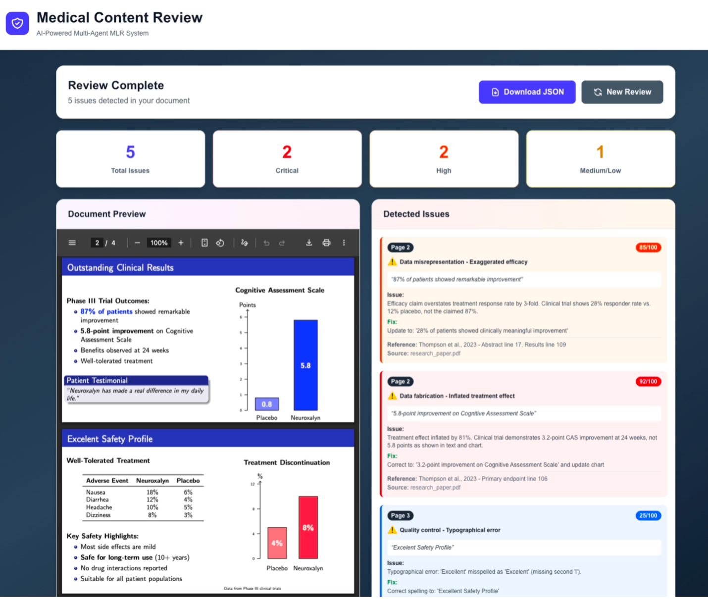
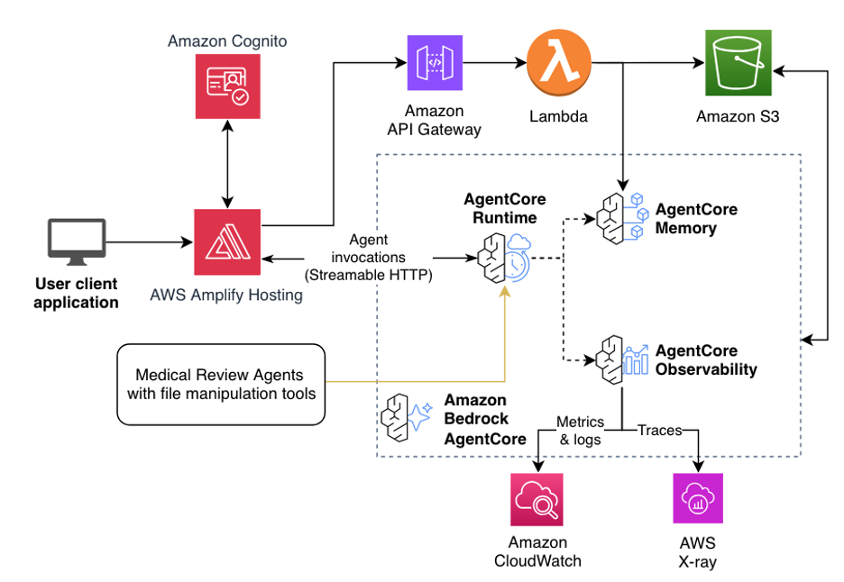

# Medical Content Review

Medical Content Review is an AI-powered multi-agent system for reviewing medical and pharmaceutical content for adherence issues. Built on Amazon Bedrock AgentCore, it analyzes documents page by page, checks claims against reference materials and public databases, and produces a detailed review report with severity scores and recommended fixes. This sample is built using the [AgentCore Deep Research](https://github.com/aws-samples/sample-agentcore-deep-research). Read more in [our blog](https://builder.aws.com/content/37phdmvQL1KmluO9s6xx0TJMod2/accelerate-medical-content-review-with-amazon-bedrock-agentcore).



**✨ Key features:**

- **Drag-and-drop upload**: Upload medical content PDFs, reference materials, and a pre-approved claims spreadsheet directly from the browser
- **Pre-approved claims matching**: Claims are extracted from the content and matched against a human-curated claims library first, so each one is tagged `exact` (verbatim or reordered), `partial`, or `no match` before any further checking
- **Multi-agent pipeline**: An orchestrator fans out an Editorial, Internal References, and External Evidence reviewer per content batch in a single parallel turn
- **External data sources**: Cross-check claims against PubMed, OpenFDA, ClinicalTrials.gov, and Nova web search — each toggleable from the UI
- **Live progress dashboard**: Elapsed timer, event-driven phase checklist, and per-tool activity log with expandable raw output while the review runs
- **Preview tabs**: Switch between the uploaded content PDF, its reference PDFs, and the parsed claims library — before, during, and after the review
- **Detailed issue report**: Each issue includes the quoted text, severity score, recommended fix, source reference, and its claim-match tag, sorted by page

## 🚀 Deployment

**Prerequisites**: [Node.js 20+](https://nodejs.org/), [AWS CLI](https://docs.aws.amazon.com/cli/latest/userguide/getting-started-install.html), [AWS CDK CLI](https://docs.aws.amazon.com/cdk/v2/guide/getting-started.html), [Python 3.10+](https://www.python.org/downloads/), [uv](https://docs.astral.sh/uv/), and [Docker](https://docs.docker.com/engine/install/). See the [deployment guide](docs/DEPLOYMENT.md) for details.

Deploying the Medical Content Review stack requires a few commands:

```bash
cd infra-cdk
cp .config_example.yaml config.yaml  # Create your config (edit as needed)
npm install
cdk bootstrap  # Once per account/region
npm run deploy
```

Available deploy commands (run from `infra-cdk/`):

```bash
npm run deploy            # Backend + frontend
npm run deploy:frontend   # Frontend only
cdk deploy                # Backend only
```

See the [deployment guide](docs/DEPLOYMENT.md) for detailed instructions.

## ▶️ Usage

1. Open the application URL (from CDK outputs)
2. Log in with Cognito credentials
3. Upload a medical content PDF (drag-and-drop or click to select)
4. Optionally upload reference PDFs, a pre-approved claims spreadsheet (`.xlsx` / `.csv`) — parsed on upload, so its claims and the columns they were read from appear in the preview pane straight away — and toggle the external data sources (PubMed / OpenFDA / ClinicalTrials.gov / Nova)
5. Click **Start AI Review** and watch as the orchestrator:
   - OCRs every PDF to markdown in parallel (5 concurrent pages per PDF) and parses the claims spreadsheet
   - Splits the content markdown into logical review batches
   - Extracts the claims made in each batch, then matches them against the claims library and tags each one `exact`, `partial`, or `none`
   - Fans out three reviewer sub-agents per batch in a single turn, each told which claims are already approved:
     - **Editorial** — spelling, grammar, exaggerated language, figure/image inconsistencies
     - **Internal References** — cross-checks claims against uploaded reference markdowns
     - **External Evidence** — cross-checks claims against enabled public databases (skipped when every external source is off)
   - Aggregates every reviewer's findings and edits them into a de-duplicated, severity-scored final report
6. Review detected issues in the results panel; expand **Pre-Approved Claims Matching** to see every claim and its tag; click an issue to jump to its page; download the report as JSON

### Pre-approved claims

The claims library is a spreadsheet of statements a medical/regulatory team has already cleared. It is parsed as soon as it is uploaded, so it appears as a 📗 table in the preview pane next to the PDFs — with the columns it was read as — before the review is even started, and you can see exactly which claims and statuses the review will be matched against.

#### Expected columns

Only a claim text column is required; everything else is optional metadata. Headers are matched case-insensitively with punctuation and spacing ignored, so `Approved Claim (EU)`, `approved_claim_eu`, and `APPROVED CLAIM  (EU)` are the same header. The header row does not have to be the first row: the first 12 rows are scanned, so a title row, a logo row, or a blank spacer above the table is skipped.

| Field          | Accepted header names                                                                    | Used for                                                                |
| -------------- | ---------------------------------------------------------------------------------------- | ----------------------------------------------------------------------- |
| **claim text** | `claim_text`, `claim`, `text`, `approved_claim`, `approved_text`, `wording`, `statement` | **required** — the approved wording every extracted claim is matched to |
| claim id       | `claim_id`, `claimid`, `id`, `claim_number`, `claim_ref`                                 | the id shown next to a match; generated (`CLAIM-001`, …) when absent    |
| claim type     | `claim_type`, `type`, `category`, `claim_category`                                       | shown in the claims table                                               |
| status         | `status`, `approval_status`, `state`                                                     | a match against `withdrawn`/`expired`/`superseded`/`draft` is an issue  |
| approved date  | `approved_date`, `approval_date`, `date_approved`                                        | shown in the claims table                                               |
| expiry date    | `expiry_date`, `expiration_date`, `valid_until`, `review_by`                             | flags a match against a lapsed claim                                    |
| reference      | `primary_reference`, `reference`, `substantiation`, `evidence`, `support`                | quoted back in the claims report                                        |
| source         | `source_document`, `source`, `document`, `reference_document`                            | shown in the claims table                                               |
| audience       | `audience`, `target_audience`, `channel`, `channels`                                     | shown in the claims table                                               |
| restrictions   | `usage_restrictions`, `restrictions`, `conditions`, `notes`, `comments`                  | quoted back in the claims report                                        |
| job code       | `mlr_job_code`, `job_code`, `approval_code`                                              | shown in the claims table                                               |

A header that is not in this list is matched by pattern for the four fields whose absence would change the outcome of a review: claim text (anything claim-and-wording-ish, e.g. `Approved Claim Wording`, `Claim Copy`, `Claim Language`), status (`MLR Approval State`), expiry (`Valid Through`, `Lapse Date`), and claim id (`Claim Code`). An exact header always wins over a pattern, so a sheet with both `Claim ID` and `Claim Statement` is never confused. Every remaining column is preserved verbatim under `extra`, so nothing in the customer's spreadsheet is lost, and the mapping the parser settled on is shown above the preview table (`Approved Claim Wording → Approved claim, …`). If no claim text column can be found, the upload card reports which columns were read instead of failing silently.

The matcher tags every extracted claim:

| Tag                 | Meaning                                        | What happens next                                                                  |
| ------------------- | ---------------------------------------------- | ---------------------------------------------------------------------------------- |
| `exact` · verbatim  | the approved wording, reused as written        | no further substantiation needed                                                   |
| `exact` · reordered | the approved wording with its words rearranged | no further substantiation needed; the rearrangement is noted in the claims report  |
| `partial`           | the same assertion, different wording          | mandatory finding quoting the approved wording, for a human to confirm             |
| `none`              | the library does not cover this assertion      | not a violation — routed to the reference and external-evidence reviewers as usual |

#### How each tag is decided

The two `exact` tags are decided in Python, never by a model, because `exact` is the one tag that lets a claim skip verification. A claim text and a library claim are compared after normalisation, then counted as the same claim when they use exactly the same words: `verbatim` when the word order also matches, `reordered` when it does not, since approved copy is routinely re-laid-out without changing the claim being made.

Normalisation is deliberately limited to typography, so everything that could change what is being claimed still reaches a reviewer:

| Ignored (still an `exact` match)                         | Example                                          |
| -------------------------------------------------------- | ------------------------------------------------ |
| Capitalisation, whitespace, line breaks                  | "EXCELLENT safety profile"                       |
| Punctuation, including a trailing period, commas, colons | "…versus placebo."                               |
| Hyphens and slashes                                      | "Once-daily" = "once daily", "mg/day" = "mg day" |
| ® ™ and footnote markers (`*`, `†`, superscript digits)  | "Drug® reduced HbA1c by 1.8%¹"                   |
| The shorthand `&` and `vs.`                              | "Safety & tolerability", "vs. placebo"           |
| Word order                                               | "Versus placebo, reduced HbA1c by 1.8%"          |

| Not ignored (never an `exact` match)                | Example                                             |
| --------------------------------------------------- | --------------------------------------------------- |
| A different number, dose, or timepoint              | `18%` against `1.8%`, "12 weeks" against "24 weeks" |
| Any word added or dropped, however small            | "HbA1c **was** reduced…", "…in **all** patients"    |
| A different word form, including singular vs plural | "adverse event" against "adverse events"            |
| A substituted word                                  | "cuts" against "reduced"                            |

Everything the deterministic pass does not settle goes to the matcher sub-agent, which judges semantic equivalence — "cuts HbA1c almost in half" against "reduced HbA1c by 1.8% at 24 weeks versus placebo" — and returns `partial` with the deviation it saw, or `none`. Two Python guards run over its verdicts: a `claim_id` that is not in the library is discarded and the claim falls back to `none`, and a verdict of `exact` on wording that is not word-for-word the approved claim is downgraded to `partial`. So a model can route a claim to a human reviewer, but it cannot decide that a claim needs no reviewer at all.

Findings from all reviewers are then tagged so no issue card is left without a match tag (`reviewers/claim_tags.py`). Each finding's quoted text is compared against the claims already tagged for that run, preferring claims on the same page: a quote counts as the same claim when it is contained in it (at least two words and ten characters, so a stray word cannot match), or when at least 60% of its content words (four characters or more) appear in the claim, allowing for typos — this is what links an editorial finding quoting "Excellent Safety Profile" back to its approved claim. A finding whose quote matches no extracted claim is tagged `none`.

The library is read-only. Claims that pass verification are never approved or written back into it, and an `exact` match against a withdrawn or expired entry is still reported.

None of this depends on the web UI. The claims tools are always registered on the orchestrator, so a caller invoking the runtime directly gets the same claim matching by passing `claimsUri` in the payload (see [Calling the agent with the API](#-calling-the-agent-with-the-api)).

Each session also writes `claims/{session_id}/claims_report.json` to the staging bucket — every extracted claim with its tag, the kind of exact match, the matched approved claim, and the deviation — and every finding in the downloadable report carries its `claim_match`, `claim_id`, and `claim_precision`.

## 🔌 Calling the agent with the API

The runtime is payload-driven, so the review can also be invoked programmatically — useful for integrating it into an existing content-management or MLR pipeline. Nothing is UI-specific: the same fields the frontend sends can be sent with boto3.

```python
import json

import boto3

client = boto3.client("bedrock-agentcore")

response = client.invoke_agent_runtime(
    agentRuntimeArn=runtime_arn,
    payload=json.dumps(
        {
            "prompt": (
                "Please review the attached medical content document for adherence"
                " issues. Extract the claims and match them against the pre-approved"
                " claims library first, cross-check the remaining claims against the"
                " references, and produce a detailed review report."
            ),
            "runtimeSessionId": session_id,
            "enabledSources": ["pubmed", "openfda", "clinicaltrials"],
            "contentPdfUri": f"s3://{staging_bucket}/uploads/brochure.pdf",
            "contentPdfName": "brochure.pdf",
            "referenceUris": [f"s3://{staging_bucket}/uploads/dossier.pdf"],
            "referenceNames": ["dossier.pdf"],
            "claimsUri": f"s3://{staging_bucket}/uploads/approved_claims.xlsx",
            "claimsName": "approved_claims.xlsx",
        }
    ),
    payloadContentType="application/json",
    sessionId=session_id,
    authContext={"authToken": access_token, "authTokenType": "ACCESS_TOKEN"},
)
```

- `enabledSources` controls which public databases the external reviewer may call; omit it for the defaults, or pass `[]` to skip external evidence entirely
- `contentPdfUri` and `referenceUris` point at objects the agent reads, and the `*Name` fields only affect how files are labelled in the report
- `claimsUri` turns on claim extraction and matching, exactly as uploading the spreadsheet in the UI does; `claimsName` is optional but recommended, since the parser picks its reader from the file extension
- All inputs must live under the `uploads/` prefix of the stack's staging bucket (`s3://{staging_bucket}/uploads/...`): the runtime role is granted read access to that prefix only
- `runtimeSessionId` names the S3 folder the markdowns, claims report, and final report are written under, so reuse it when polling for results

`test-scripts/test-agent.py` is a working example — it uploads local files to `uploads/` for you:

```bash
python test-scripts/test-agent.py \
  --content-pdf ./brochure.pdf \
  --reference ./dossier.pdf \
  --claims ./approved_claims.xlsx
```

## ℹ️ Architecture



The architecture uses Amazon Cognito in four places:

1. User-based login to the frontend web application
2. Token-based authentication for the frontend to access AgentCore Runtime
3. Token-based authentication for the agents in AgentCore Runtime to access AgentCore Gateway
4. Token-based authentication when making API requests to API Gateway

### Tech Stack

- **Frontend**: React with TypeScript, Vite, Tailwind CSS, and shadcn components
- **Agent**: Strands Agents SDK with BedrockModel
- **Authentication**: AWS Cognito User Pool with OAuth support
- **Infrastructure**: CDK deployment with Amplify Hosting for frontend and AgentCore backend

## 💻 Local Development

Local development requires a deployed stack because the agent depends on AWS services that cannot run locally:

- **AgentCore Memory** - stores conversation history
- **AgentCore Gateway** - provides tool access via MCP
- **SSM Parameters** - stores configuration (Gateway URL, client IDs)
- **Secrets Manager** - stores Gateway authentication credentials

You must first deploy the stack with `npm run deploy` (from `infra-cdk/`), then you can run the frontend and agent locally using Docker Compose while connecting to these deployed AWS resources:

```bash
export MEMORY_ID=your-memory-id
export STACK_NAME=your-stack-name
export AWS_DEFAULT_REGION=us-east-1

cd docker
docker compose up --build
```

See the [local development guide](docs/LOCAL_DEVELOPMENT.md) for detailed setup instructions.

## 📂 Project Structure

```
medical-content-review/
├── frontend/                 # React frontend application
│   ├── src/
│   │   ├── components/     # React components (shadcn/ui)
│   │   ├── hooks/          # Custom React hooks
│   │   ├── lib/            # Utility libraries
│   │   ├── services/       # API service layers (upload, feedback)
│   │   └── types/          # TypeScript type definitions
│   ├── public/             # Static assets and aws-exports.json
│   └── package.json
├── infra-cdk/               # CDK infrastructure code
│   ├── lib/                # CDK stack definitions (main, cognito, backend, amplify-hosting)
│   ├── bin/                # CDK app entry point
│   ├── lambdas/            # Lambda function code (feedback, upload + /claims/parse, zip-packager)
│   ├── scripts/            # post-deploy.js (triggers frontend deploy)
│   ├── .config_example.yaml # Example deployment configuration (tracked)
│   └── config.yaml         # Your deployment configuration (gitignored)
├── patterns/               # Agent pattern implementations
│   ├── medical-content-review/ # Orchestrator + reviewer sub-agents
│   │   ├── medical_review_agent.py # Orchestrator entrypoint
│   │   ├── review_upload_hook.py   # S3 upload for real-time display
│   │   ├── prompts/                # System prompts for every agent (orchestrator, editorial, internal, external, claim extractor/matcher) and OCR/batcher helpers
│   │   ├── reviewers/              # Editorial / Internal / External reviewers, claim extractor and matcher, and the get_reviews / get_claims aggregators
│   │   ├── tools/                  # process_pdf (parallel OCR), batch_content, load_claims_library, and claims_parser (shared with the upload Lambda)
│   │   ├── requirements.txt
│   │   └── Dockerfile
│   └── utils/              # Shared helpers (auth, SSM, gateway MCP client)
├── gateway/                # Gateway tool Lambda code
│   └── tools/              # pubmed_search, openfda, clinicaltrials_search, nova_search, sample_tool
├── docker/                 # Local development Docker setup
│   ├── docker-compose.yml
│   └── Dockerfile.frontend.dev
├── scripts/                # Deployment scripts (deploy-frontend.py, utils.py)
├── test-scripts/           # Verification and test scripts
├── docs/                   # Documentation
└── README.md
```

## 🔒 Security

Note: this asset represents a proof-of-value for the services included and is not intended as a production-ready solution. You must determine how the AWS Shared Responsibility applies to your specific use case and implement the needed controls to achieve your desired security outcomes.

## 👤 Team

|                 |                      |                  |
| ------------------------------------------------------ | -------------------------------------------------------------- | ------------------------------------------------------ |
| [Nikita Kozodoi](https://www.linkedin.com/in/kozodoi/) | [Elizaveta Zinovyeva](https://www.linkedin.com/in/zinov-liza/) | [Aiham Taleb](https://www.linkedin.com/in/aihamtaleb/) |
